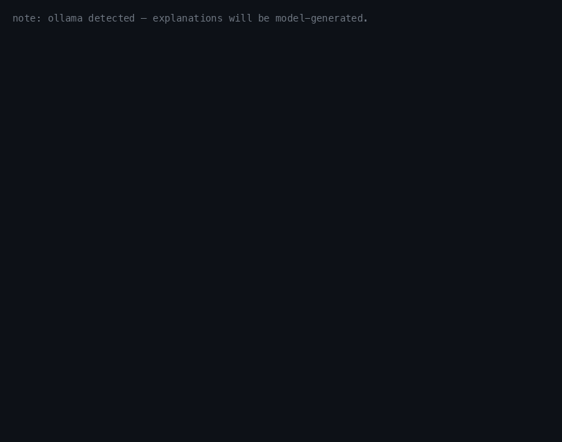

# FantasyForecast

A fantasy football draft engine that prices every pick in **dollars of expected league winnings**, by simulating the rest of the season a few hundred times before you're on the clock.

Most draft tools rank players by projected points. Points aren't what you win. A league that pays the top three finishers rewards a roster that reaches the money, and the roster that maximizes expected points is not usually the roster that maximizes expected payout — the two diverge exactly where variance matters. This engine optimizes the thing you actually get paid on.

It runs locally on a laptop, answers inside a 25-second pick clock, and degrades on a timer instead of stalling. There is a terminal cockpit and a browser one; the browser cockpit can follow a live league draft.

```
[round 1, pick 4 of 180, YOU on the clock — you are up]

tier 0  Jahmyr Gibbs  (10.5s)   E[$] +45.62 +/- 2.15
  stale: no_prior_season=66
       player_name position  adp  E_dollars  aleatory_se  epistemic_se  draws
      Jahmyr Gibbs       RB  1.6      45.62         1.51          1.53     50
 Amon-Ra St. Brown       WR  7.2      34.42         2.31          3.11      4
Jaxon Smith-Njigba       WR  5.9      26.38         2.33          1.44      2
        Puka Nacua       WR  2.7      25.85         2.34          6.07      2
  separating axis: weekly_high

WHY (ollama):
  Jahmyr Gibbs has a slight edge over Amon-Ra St. Brown in weekly highs
  more than $0.55. Both players are slightly ahead for the championship,
  but Jahmyr Gibbs edges out Amon-Ra St. Brown more than $0.49.
```

(That output is verbatim, awkward phrasing included. A 7B model writing under a
schema constraint produces clumsy sentences; the tradeoff is that every quantity
in them is checked against the simulation record before it prints.)

Read that output as: Gibbs is worth about **$46 of expected winnings**, ±$2. The `draws` column shows the simulator spent 50 parameter draws on him and 2–4 on the others — a successive-halving allocator that stops paying for candidates already out of contention. `separating_axis` names *why* he leads: weekly-high payouts, not championship equity.

`stale: no_prior_season=66` is the board telling on itself — 66 of 246 players (rookies, and everyone who didn't play in 2025) have no prior-season line, so their value comes from a replacement-level floor rather than a projection. The engine prints what it's unsure about instead of quietly averaging it away.

---

## Table of contents

- [What makes it different](#what-makes-it-different)
- [Demo](#demo)
- [How it works](#how-it-works)
- [What's actually validated](#whats-actually-validated)
- [Setup](#setup)
- [Running a draft](#running-a-draft)
- [Architecture](#architecture)
- [Testing](#testing)
- [Known limitations](#known-limitations)
- [Glossary](#glossary)

---

## What makes it different

**It optimizes payout, not points.** Your league's prize structure is a config file — winner-take-all, top-three, weekly high-score side pots, whatever you actually play. The objective compiles from that config, so a league that pays weekly highs produces different picks than one that pays only the champion. Same roster, different money.

**It simulates instead of scoring.** Each candidate is evaluated by drawing full seasons for all 12 rosters: correlated weekly performances, injury hazard, bye weeks, lineup decisions made on *pre-week* projections and scored on *drawn* outcomes. A 14-week regular season, then a 6-team bracket over weeks 15–17, then the payout rules — all read from config.

The non-clairvoyance rule is the load-bearing one: lineups are chosen on projections and scored on draws. Choosing on the draws inflates every roster, inflates high-variance rosters most, and reverses exactly the ceiling-vs-floor conclusions the simulator exists to produce. The lineup function takes selection values and realized values as two separate arguments so the rule can't be violated by accident at a call site.

**It reports its own uncertainty, decomposed.** `aleatory_se` is simulation noise — more replications shrinks it. `epistemic_se` is parameter uncertainty — more replications will *not* shrink it, because it comes from a bootstrap posterior over the fitted correlation matrix. Conflating the two is how simulators talk themselves into false confidence. When two candidates overlap, the engine says so and returns an indifference set rather than a fake ranking.

**It degrades on a wall clock.** Four tiers: full two-level Monte Carlo (0), single-level (1), VONA (2), static board (3). If tier 0 misses its deadline the ladder demotes automatically and tells you which rung answered. A draft tool that hangs is worse than one that's approximate — you have 25 seconds either way.

**Its explanations can't hallucinate a number.** A local LLM writes the "why," but never sees or emits a numeric value: it picks a subject and a comparator from a schema-constrained enum, and the numbers are read off the simulation record afterward. Every clause is then checked against that record and dropped if it doesn't entail. On the 20-record benchmark (`scripts/bench_narration.py`, includes near-ties, split prizes, and bye conflicts) `qwen2.5:7b` currently passes 20/20 at 3.7s median; earlier runs sat at 96–97%. Failed clauses are discarded silently and the fallback is a plain table, so narration is never load-bearing.

That benchmark started at **0/12**. Four defects, all in the harness rather than the model: the prompt showed the model the values so it copied them; the directional margin was smaller than the gate's own tolerance; `subject` and `quantity` were independent enums, making impossible combinations expressible; and the slot label `"RB2"` contains a digit, which the numeral check flagged.

**Every recommendation is hash-chained.** The ledger is append-only with a sha256 chain, so in November you can see what the engine said in August and prove it wasn't edited after the season embarrassed you.

---

## Demo



### One command

```bash
bash scripts/demo.sh
```

Drives the real cockpit through a scripted sequence against the real bundle — three opponent picks, the engine's recommendation at seat 4, the pick, the ledger, and an `undo`. No interaction, no network, nothing stubbed.

The `undo` at the end is the part worth watching: the engine re-runs and returns **E[$] +45.62 ± 2.15** again, to the cent. That's Common Random Numbers doing their job — the same candidate evaluated against the same simulated seasons gives the same answer, which is what makes a $2 edge between two players meaningful instead of noise.

```
[round 1, pick 5 of 180, seat 5 on the clock — 16 until your pick]
>   pick   4  tier 0  Jahmyr Gibbs -> Jahmyr Gibbs
  1 entries verified

[round 1, pick 5 of 180, seat 5 on the clock — 16 until your pick]
>   undone. round 1, pick 4 of 180, YOU on the clock — you are up
```

The GIF above is that command's own output. To regenerate it:

```bash
bash scripts/demo.sh > /tmp/demo.txt 2>&1
venv/bin/python scripts/make_demo_gif.py /tmp/demo.txt docs/demo.gif
```

`make_demo_gif.py` replays captured stdout at a readable pace — a real-time
recording would be nearly a minute of static screen, since each pick spends
~10s in the simulator and ~3s in the narration model. It renders bytes the
engine actually printed; it never composes text of its own.

### A full 180-pick rehearsal

`scripts/mock_draft.py` plays an entire draft against eleven ADP bots — nothing stubbed, same ladder, ledger, and identity resolution as draft night.

```
$ venv/bin/python scripts/mock_draft.py --seat 4

MOCK DRAFT — seat 4, 12x15, clean
  bundle sn2_270597d436defec783c57190, 246 players, latency budget 25s

  pick   4 (mine)  tier 0  Jahmyr Gibbs             8.6s
  pick  21 (mine)  tier 0  Josh Allen               7.5s
  pick  28 (mine)  tier 0  Malik Nabers             7.5s
  pick  45 (mine)  tier 0  D'Andre Swift            7.5s
  pick  52 (mine)  tier 0  TreVeyon Henderson       7.4s
  ...
  pick 172 (mine)  tier 0  Kimani Vidal             6.2s

  180 picks recorded, 15 mine
  my roster: Jahmyr Gibbs (RB), Josh Allen (QB), Malik Nabers (WR),
             D'Andre Swift (RB), TreVeyon Henderson (RB), Jalen Hurts (QB),
             Chris Godwin Jr. (WR), Josh Downs (WR), George Kittle (TE),
             Alvin Kamara (RB), Zach Charbonnet (RB), James Conner (RB),
             Kimani Vidal (RB), Kayshon Boutte (WR), Oronde Gadsden (TE)

  LATENCY
    median 7.1s   max 8.6s   budget 25s
    over budget: 0 of 15
  TIERS USED: tier 0: 15
  LEDGER: 15 entries verified

  REHEARSAL PASSED
```

The pass criterion is deliberately not "no exception." It's that every pick came back inside the latency budget *and* the ledger chain verifies. A tool that survives by silently doing nothing has not survived.

### Chaos mode

`--chaos` injects the failures that actually happen at a draft, rather than the ones that are easy to simulate:

| Injection | What it tests |
|---|---|
| A name nobody can resolve | typo'd surname mid-draft |
| A player taken twice | someone calls a name already gone |
| An undo under time pressure | the classic |
| An injury scratch | `zero` on a rostered player |
| A mid-draft restart | process dies, resume from disk |

The rehearsal asserts all five actually fired — otherwise a passing run proves nothing. Three rehearsals (two chaos, seats 4 and 9) pass at median 5.9–6.5s per pick.

Every one of these was found by playing a draft end to end, and none were visible to a unit test:

- `taken_rows` was never populated, so every rollout began at pick 1 with twelve empty rosters — the engine was answering "best player on a roster built from scratch" *at every pick*, and produced an illegal 8-WR/5-RB team with no QB.
- Candidate rows addressed the wrong frame, so at pick 165 it recommended a player taken at pick 1.
- Tier 0 returned a row index where tiers 2/3 returned a player id — same field, different meaning per rung, corrupting the ledger.
- `undo` followed by a re-pick hit a `UNIQUE` constraint and killed the terminal at pick 45. An append-only chain records a correction by *appending*; the constraint was wrong.

---

## How it works

```
nflverse box scores ──┐
                      ├──▶ weekly panel ──▶ σ model, hazard model, K/DST distributions
FFC ADP ──────────────┘                              │
                                                     ▼
                                       correlated season draws (Cholesky)
                                                     │
                              ┌──────────────────────┴──────────┐
                              ▼                                 ▼
                      opponent rollout                   greedy lineups
                              │                                 │
                              └──────────────────┬──────────────┘
                                                 ▼
                                schedule ▶ bracket ▶ payout objective
                                                 ▼
                                     E[$] per candidate ± SE
                                                 ▼
                               allocator ▶ indifference set ▶ ladder

        (waiver floor: built and tested, not yet wired into the kernel)
```

**Projections.** A pooled LightGBM quantile GBM (P10/P50/P90, position as a categorical feature — not per-position models) predicts per-game scoring rate. Quantile crossing is fixed by rearrangement rather than clipping, and intervals are calibrated per player-type bucket with split conformal.

**Weekly variance.** Season rates alone can't price a boom/bust player. A separate model fits within-season σ, so two players with identical projections but different week-to-week spread produce different payout distributions — which is the entire point when the league pays weekly high scores.

**Correlation.** Same-team players move together. The design originally assumed a one-factor model; measuring it ruled that out, so the engine uses an **empirical slot correlation matrix** with a Cholesky factor, and a block bootstrap over it supplies the epistemic posterior.

**Common Random Numbers.** Every draw is addressed by a counter-based RNG (blake2b-derived key + Philox), so candidate A and candidate B are compared on *the same simulated seasons*. This is the difference between resolving a $2 edge in 200 replications and needing 20,000. Inverse-CDF sampling is used throughout — never Ziggurat — so extending a draw reuses its prefix instead of redrawing it.

Because CRN makes replications dependent, the standard error is `sd_r(mean_k D[r,:]) / sqrt(R)` — *not* `/ sqrt(K*R)`. The naive form would understate uncertainty by roughly the square root of the number of candidates.

**Allocation.** Successive halving concentrates replications on candidates still in contention. That's what the lopsided `draws` column above shows: 50 for the leader, 2 for a candidate already eliminated.

---

## What's actually validated

The project runs a **pre-registered power audit** before reporting any result, and it downgrades its own claims. Of seven declared gates, three are powered enough to claim and four are explicitly labeled descriptive-only:

```
gate                                   n   deff   n_eff       MDE  power  verdict
---------------------------------- ----- ------ ------- --------- ------  ----------------
ndcg_at_84_vs_adp                      8   1.00     8.0    0.0218   0.97  claim
ndcg_at_36_vs_adp                      8   1.00     8.0    0.0277   0.71  claim
reliability_spearman_at_84           200   4.50    44.4    0.0504   0.79  claim
expected_dollars_vs_adp_bots         200   4.85    41.2   17.8872   0.09  descriptive_only
quantile_coverage_by_bucket          140   1.00   140.0    0.0947   0.14  descriptive_only
objective_backtest_weekly_high         8   2.30     3.5    0.1127   0.11  descriptive_only
opponent_model_pick_change_rate      200   4.50    44.4    0.0916   0.33  descriptive_only
```

`deff` is the Kish design effect, `1 + (m-1)ρ`. Twelve rosters drawn from one simulated draft are not twelve independent observations; ignoring that turns 200 drafts into a claim they can't support. Here it cuts 200 → 41 effective.

The headline consequence: **"our engine beats ADP bots by $4" is not a claim this project is allowed to make.** Detecting a $4 effect would need ~4,000 simulated drafts; 200 gives 9% power. The number is reported as a descriptive statistic with that caveat attached, every time.

**Three findings the audits produced that a green checkmark would have hidden:**

*The opponent model failed its own gate.* Fitting per-manager draft tendencies from league history didn't beat a league-mean baseline (permutation p = 0.135). The design pre-committed to `on_fail: fall_back_to_defaults`, so the engine ships league-mean + slot covariate and the per-manager policies were never built. Recorded as a null result rather than quietly kept.

*The distributional backtest points at the instrument.* The PIT histogram slopes downward — the predictive distribution is biased high:

```
[0.0,0.1)  1.28  ##########################
[0.1,0.2)  1.05  #####################
...
[0.8,0.9)  0.83  #################
[0.9,1.0)  0.70  ##############
```

Re-running with shrinkage isolates the cause: KS p goes 0.0000 → 0.0134 → 0.6989 at shrink 0.00 / 0.20 / 0.35. Raw prior-season PPG doesn't regress to the mean, so it overstates next season for exactly the players a value draft selects — the ones coming off career years. The shipped quantile model already regresses (OOF P10–P90 coverage 0.808 against 0.80 nominal), placing it on the passing side of that sweep. The failure is the backtest's naive instrument, not the simulator.

*The Sobol variance decomposition doesn't converge* — and for a structural reason worth stating: the sensitivity design can't share a common random base across its A/B matrices, so simulator Monte-Carlo noise gets charged to the "interaction" term. Reported as non-converged rather than presented as an interaction effect.

**Latency**, measured on the reference machine (Apple M4 Pro, 24 GB), across three full rehearsals: median 5.9–7.1s per pick against a 25s budget, tier 0 every time, zero demotions.

### The gap: no end-to-end result yet

The engine has **not been measured against the draft market**, and this README will not imply otherwise.

An earlier version of this project did carry that measurement — its projection layer beat ADP on NDCG in 8 of 8 test seasons, and its recommender beat ADP-following bots by ~4.7 starting-lineup points per game. Those numbers came from a benchmark harness that was deleted with the rest of v1, so they cannot be reproduced from this tree and they describe a different recommender. They are in git history, not in this table.

For the current engine, `expected_dollars_vs_adp_bots` is declared in `config/power_assumptions.yaml` with `effect_provenance: assumed` and **has no implementation**. The $4 figure in the power audit is the effect size used to *size* the test, not a result of running it.

What that means honestly: the machinery above — payout-aware objective, decomposed uncertainty, CRN, the degradation ladder — is better-founded than what it replaced, and it is unproven. `scripts/mock_draft.py` already plays 180 picks against eleven ADP bots with the real engine on one seat, so the missing piece is scoring all twelve final rosters over many seeds and reporting a paired interval. That is the next thing worth building, and until it exists the correct summary of this project's edge over the market is "not yet demonstrated."

---

## Setup

```bash
python -m venv venv && source venv/bin/activate
pip install -r requirements.txt
```

That's everything the **draft cockpit** needs. `scripts/demo.sh`,
`scripts/draft_night.py`, and `scripts/mock_draft.py` read a single
self-contained parquet bundle — no database, no API key, no `.env`.

**One correction to an earlier version of this README**, which claimed the
recommendation path "never opens a socket": it does, and always did.
`bundle_build.nflverse_covariates` fetches hazard covariates on every tier-0
run. The engine core is network-free; the covariate load is not. The web
cockpit adds a deliberate network transport on top, and falls back to manual
entry when the feed dies.

The database configuration below is only for **rebuilding** that bundle from source data.

League settings — scoring, roster slots, schedule, payout structure — live in `config/league.yaml`; simulation, ADP, opponent and narration settings live in `config/strategy.yaml`. Changing either requires rebuilding the bundle; the config version hash is embedded in every artifact so a stale bundle can't silently pair with a new config.

### Optional: local narration

Explanations run on a local model, so nothing leaves the machine and there's no API key:

```bash
ollama serve
ollama pull qwen2.5:7b
```

Without it, the engine falls back to a plain table. Narration is never load-bearing.

### Rebuilding the bundle

Three commands, reading nflverse and FFC directly. There is no database anywhere in this project — an earlier version had a Postgres research/serving split, and it was deleted along with the rest of v1.

```bash
python scripts/train_projection_v2.py     # quantile GBM -> projections artifact
python scripts/fit_models.py              # weekly sigma, hazard, K/DST, correlation
python scripts/build_bundle.py --season 2026
```

---

## Running a draft

```bash
python scripts/draft_night.py --seat 4
python scripts/draft_night.py --seat 4 --resume
```

Type a name to record whoever is on the clock. The board rebuilds by replay after every command, so `undo` always works and closing the terminal costs nothing.

| Command | Effect |
|---|---|
| `<name>` | record the pick on the clock (fuzzy matched) |
| `me <name>` | record my pick |
| `go` | recommend now (automatic when I'm on the clock) |
| `board [n]` | print the top n available |
| `roster` | print my roster |
| `zero <name>` | injury/news: this player is worthless, no restart |
| `adp <name> <n>` | override a player's ADP |
| `undo` | undo the last command |
| `log` | show the decision ledger |
| `quit` | exit |

**Sessions are event-sourced.** State is a pure function of the event log, so `undo` is a pop-and-replay rather than a hand-maintained inverse operation, and a crash costs nothing — the log is written atomically after every command.

**Names resolve through a cascade**: exact id → manual override (`config/id_overrides.yaml`) → deterministic normalization → fuzzy (`token_sort_ratio`) → unresolved. An unresolvable name is *recorded as unresolved* rather than dropped, so the board stops offering a player who's actually gone.

---

## Architecture

Six layers, imports strictly downward, enforced by `tests/test_layer_deps.py`:

```
app       (L5)  cockpit, narration
engine    (L4)  decision, sim, audit
models    (L3)  projection, weekly, correlation, opponents
platform  (L2)  identity, bundle, asof
domain    (L1)  scoring, roster, payout
core      (L0)  config, errors, constants
```

(v1 packages — `projection/`, `features/`, `recommender/`, `ingest/`, and friends — still sit alongside these. They're tracked in a `LEGACY_PACKAGES` set that the layer test asserts can only ever *shrink*, so the migration can't silently stall.)

**The ADP wall is structural, not a convention.** The draft market must never reach the projection model, or the engine ends up measured against a signal it was trained on. Rather than a code-review rule, `models/**` may import exactly one platform module — `platform.asof`. That single clause buys three guarantees at once: no ADP import (ADP lives in `platform.sources`), no DB access (`platform.persistence`), and point-in-time discipline, since `asof` is the only door. Enforced by `test_layer_deps.py`.

**Leakage.** Feature columns may only use data available before Week 1 of the target season. In-season stats in a preseason feature is a fatal research bug, and the guard is a test rather than discipline.

**Snapshot reproducibility.** Every DB write and every artifact carries a `snapshot_id`. nflverse retroactively corrects historical stats, so "the same query" is not reproducible without one.

**Quantile monotonicity.** P10 ≤ P50 ≤ P90 is enforced by rearrangement and tested. It's easy to violate accidentally — an early elasticity knob scaled P50 past P90, which clamped the split-normal inverse CDF to zero and deleted the upper tail, moving a reported value in the *wrong direction*.

---

## Testing

```bash
venv/bin/pytest      # 506 tests
```

All pass, and nothing is deselected by default. The interesting tests aren't the ones that check a function returns the right number — they're the ones that try to break an invariant:

- **`test_ledger.py`** tampers with the chain: edits a recommendation, deletes an entry, and asserts verification names the *first* broken link.
- **`test_layer_deps.py`** parses every import, enforces the layer DAG, holds the ADP wall to a single allowed module, and asserts `src/` contains only the six layers.
- **`test_truncated_rebuild.py`** rebuilds a season's features with data truncated at Week 0 and asserts the result is identical — mutation testing found three independent guard layers, and only disabling all three makes it fail.
- **`test_sim_kernel.py`** asserts extending a draw reuses its prefix and that normals come from inverse-CDF, which is what makes CRN valid.
- **`tests/oracles/ilp_lineup.py`** keeps the v1 ILP as a test oracle for the greedy lineup selector — greedy is optimal on a transversal matroid, and the oracle proves it on random rosters.

`test_latency_budget.py` is marked slow and excluded from the default run; it's exercised explicitly by the chaos rehearsals.

---

## Known limitations

Stated because they're real, not because they're exhaustive.

**The waiver floor is off during a live pick.** It is wired and runs in offline analysis, but `apply_waiver` costs ~450ms per evaluation against ~0ms for the matmul it corrects: the claim loop is sequential over a shared pool and runs ~40,000 Python iterations that don't vectorize. At ~50 evaluations per pick that is 22s of a 25s budget — measured, it took a pick from 10s to 26s and starved the allocator from 50 draws to 10. `strategy.simulation.waiver.in_decision_path` defaults to `false` until the loop is vectorized across replications.

**Every kicker is worth the same.** K and DST sit outside `modeled_positions`, so there is no per-player model for them; they all receive their position's fitted empirical mean (K 8.04, DST 6.25 pts/wk). That is enough to make them draftable in the endgame — which is the design's intent — but the engine cannot prefer one kicker over another, and the tier-3 table shows a single tier for each.

**The opponent model is league-mean.** Per-manager tendencies failed their pre-registered gate (p = 0.135) and were not built.

**Sobol indices don't converge**, for the structural reason described above.

**Yahoo integration is blocked** pending API permission: the `exact_id` identity tier, live draft polling, and validation against real league rosters all depend on it.

**Deferred by design:** stat-line multi-target projection, college/rookie production features, kicker↔offense coupling, handcuff conditional distributions.

---

## What was removed

An earlier version of this project shipped a weekly start/sit optimizer, a FastAPI service, a Next.js draft room, and a Postgres research/serving split. All of it was **deleted**, not frozen — along with nine v1 source packages, 52 test files, and the v1 spec documents.

The reason is that the engine described above needs none of it. It reads a parquet bundle and writes a local SQLite ledger; carrying a web app and a database it never opens made the project look larger while making it harder to explain, and left a second, contradictory answer to "how do I run this?" in the tree. It is all recoverable from git history if a weekly surface ever comes back.

---

## Data sources

- [nflverse](https://www.nflverse.com/) — play-by-play, rosters, schedules, Week-1 betting lines
- [Fantasy Football Calculator](https://fantasyfootballcalculator.com/) — full-PPR ADP

---

## Glossary

**Fantasy terms**

- **PPR** — Points Per Reception; 1 point per catch.
- **ADP** — Average Draft Position: where a player goes on average across thousands of public drafts. The market baseline this project is measured against.
- **FPPG** — Fantasy Points Per Game; the prediction target. A per-game *rate*, so missed games don't distort it.
- **VOR / VONA** — Value Over Replacement; Value Of Next Available (VOR now, minus the expected value of the best same-position player still there at your next pick). VONA is the tier-2 fallback ranking.
- **Streaming** — picking up a kicker or defense off waivers each week instead of drafting one.

**Model terms**

- **P10 / P50 / P90** — 10th / 50th / 90th percentile of a player's predicted outcome. The model predicts a range, not a number.
- **Quantile GBM** — gradient-boosted trees trained with pinball loss to predict a quantile directly.
- **Rearrangement** — sorting crossed quantile predictions back into order (Chernozhukov 2010); preserves calibration in a way clipping does not.
- **Split conformal** — calibrating interval width on held-out residuals so stated coverage matches empirical coverage.
- **Snapshot** — a frozen extraction of source data tagged with a `snapshot_id`, so results stay reproducible even though nflverse retroactively corrects past stats.

**Simulation terms**

- **CRN (Common Random Numbers)** — comparing alternatives on identical random draws so the comparison isn't swamped by simulation noise.
- **Aleatory vs epistemic** — noise from the simulation (shrinks with more replications) vs uncertainty in the fitted parameters (does not).
- **Successive halving** — an allocator that repeatedly discards the worst candidates and reinvests their budget in survivors.
- **PIT (Probability Integral Transform)** — mapping outcomes through their predicted CDF. If the distribution is right, the result is uniform; the shape of the deviation says *how* it's wrong.
- **Kish design effect** — `1 + (m-1)ρ`; how much clustering inflates variance, and therefore how many of your nominal samples are real.
- **Sobol indices** — variance-based sensitivity analysis attributing output variance to each input and their interactions.

**Statistics**

- **NDCG@k** — a 0–1 ranking-quality score weighting the top of the list most heavily. `k=84` ≈ the startable universe; `k=36` ≈ the early rounds.
- **MDE** — Minimum Detectable Effect: the smallest true effect a test could reliably find at the stated power. If your expected effect is below the MDE, a null result means nothing.
- **Power** — probability of detecting a real effect of the expected size. Below ~0.5 here, a gate is reported descriptively rather than claimed.
- **Wilcoxon signed-rank** — paired non-parametric significance test.
- **KS test** — Kolmogorov–Smirnov; tests whether a sample matches a reference distribution (used on the PIT histogram).
